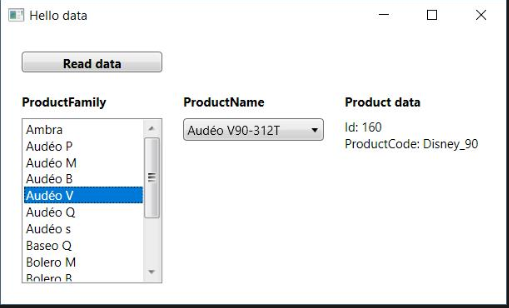

# FSW-Application-Interview

## Getting started

1. Install .NET Framework 4.6.1 or higher
2. Clone the repository
3. Run the FSW.Application.Interview.sln

## Tasks:

1. Implement an application that will load the list of hearing instruments from HearingInstrument.json and display them.
2. The mockup for the view looks as follow:

3. Underline text in Product data when mouse is over the text.
4. Implement unit tests
5. Refactor application to use DI

## Testing
